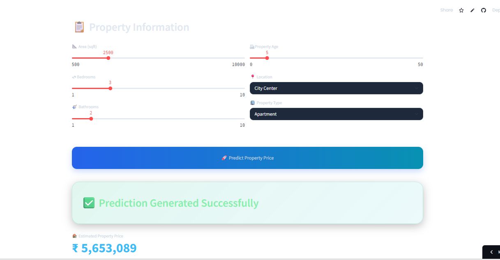

# 🚀 Real Estate Price Prediction System (Production-Grade ML System)  
**End-to-End Machine Learning Project | FastAPI Backend | Streamlit Frontend | Real-Time Property Valuation**

[](https://www.python.org/)
[](https://pandas.pydata.org/)
[](https://numpy.org/)
[](https://scikit-learn.org/)
[](https://xgboost.ai/)
[](https://fastapi.tiangolo.com/)
[](https://streamlit.io/)
[](https://plotly.com/)
[](https://render.com/)
[]()
[]()

---

# 🏠 Project Overview

This project is a **production-grade Real Estate Price Prediction System** designed to estimate property prices using Machine Learning and modern deployment architecture.

The system combines:

- ✅ Machine Learning Prediction Engine  
- ✅ FastAPI REST Backend  
- ✅ Streamlit Interactive Frontend  
- ✅ Real-Time API Communication  
- ✅ Beautiful Dark-Themed UI  
- ✅ Property Analytics Dashboard  
- ✅ Cloud Deployment  

Unlike basic ML notebooks, this project follows a **real-world full-stack ML deployment architecture** used in industry-grade AI systems.

---

# 🎯 Business Problem

Real estate pricing depends on multiple factors such as:

- Property Area  
- Number of Bedrooms  
- Bathrooms  
- Property Age  
- Location  
- Property Type  

Traditional valuation methods are often:
- Time-consuming  
- Subjective  
- Inconsistent  

## 💡 Objective

Build an AI-powered system capable of:
- Predicting property prices instantly  
- Providing smart property insights  
- Delivering scalable real-time predictions through APIs  

---

# 🏗️ System Architecture

User Input (Streamlit UI)  
        ↓  
REST API Request  
        ↓  
FastAPI Backend  
        ↓  
Feature Processing Pipeline  
        ↓  
XGBoost Regression Model  
        ↓  
Predicted Property Price  
        ↓  
Interactive Analytics Dashboard  

---

# 🛠️ Technologies Used

| Category | Technologies |
|---|---|
| Programming Language | Python |
| Data Processing | Pandas, NumPy |
| Machine Learning | Scikit-learn, XGBoost |
| Backend API | FastAPI |
| Frontend UI | Streamlit |
| Visualization | Plotly |
| Deployment | Render + Streamlit Cloud |
| API Communication | Requests |
| Model Serving | REST API |

---

# 📂 Project Structure

```bash
Real-Estate-Price-Prediction-System/
│
├── data/
├── models/
├── screenshots/
├── notebooks/
│
├── src/
│   ├── preprocessing.py
│   ├── train_model.py
│   ├── evaluate_model.py
│
├── api.py
├── app.py
├── requirements.txt
├── README.md
└── model.pkl
```

---

# 📊 Machine Learning Workflow

### 1️⃣ Data Collection
Collected structured real estate property data.

### 2️⃣ Data Cleaning
- Missing value handling  
- Data formatting  
- Feature validation  

### 3️⃣ Feature Engineering
Processed features including:
- Area  
- Bedrooms  
- Bathrooms  
- Property Age  
- Location Encoding  
- Property Type Encoding  

### 4️⃣ Model Training
Trained regression models for price prediction.

### 5️⃣ Model Evaluation
Compared model performance using regression metrics.

### 6️⃣ Model Deployment
Integrated trained model with FastAPI backend.

### 7️⃣ Frontend Integration
Connected Streamlit frontend with deployed backend API.

---

# 🧠 Machine Learning Model

| Model | Purpose |
|---|---|
| XGBoost Regressor | Final prediction model |

## Why XGBoost?
- High predictive performance  
- Handles non-linearity efficiently  
- Excellent for tabular structured datasets  
- Industry-grade ML algorithm  

---

# 📈 Model Performance

| Metric | Value |
|---|---|
| Model Type | Regression |
| Algorithm | XGBoost |
| Prediction System | Real-Time |
| Deployment Status | Live |

---

# 🎨 Frontend Features

## 🌌 Premium Dark-Themed UI
- Glassmorphism cards  
- Gradient backgrounds  
- Modern typography  
- Interactive hover effects  

## 📊 Interactive Analytics
- Property feature visualization  
- Dynamic charts using Plotly  

## ⚡ Real-Time Predictions
- API-based instant valuation system  

## 📱 Responsive Layout
- Optimized for multiple screen sizes  

---

# 🚀 How to Run Locally

## 1️⃣ Clone Repository

```bash
git clone https://github.com/AniketanandSandipkumar/Real-Estate-Price-Prediction-System.git

cd Real-Estate-Price-Prediction-System
```

---

## 2️⃣ Install Dependencies

```bash
pip install -r requirements.txt
```

---

## 3️⃣ Run Backend API

```bash
uvicorn api:app --reload
```

Backend runs at:

```bash
http://127.0.0.1:8000
```

---

## 4️⃣ Run Streamlit Frontend

```bash
streamlit run app.py
```

---

# 📡 API Usage

## Endpoint

```bash
POST /predict
```

---

## Example Request

```json
{
  "area": 2500,
  "bedrooms": 3,
  "bathrooms": 2,
  "age": 5,
  "location": "City Center",
  "property_type": "Apartment"
}
```

---

## Example Response

```json
{
  "predicted_price": 5653089
}
```

---

# 📊 Dashboard Features

## 🏠 Property Prediction
Instant AI-generated valuation.

## 📈 Feature Analytics
Interactive feature overview chart.

## 🧠 AI Insights Section
- Property Summary  
- Configuration Analysis  
- Intelligent Valuation Explanation  

---

# 🖼️ Project Preview

## 🏠 Main Dashboard


## 📊 Analytics Overview


## 🤖 Prediction Output


---

# 💡 Business Insights

- Larger property area strongly impacts valuation  
- City Center properties receive higher estimated prices  
- Villas and Houses generally predict higher values than Apartments  
- Property age influences depreciation patterns  

---

# 🔥 Key Highlights

- End-to-end ML system  
- Real-time REST API integration  
- Production-ready architecture  
- Modern premium frontend design  
- Interactive data visualization  
- Scalable deployment pipeline  
- Industry-style project structure  

---

# 🔮 Future Improvements

- Advanced geolocation intelligence  
- Real estate market trend forecasting  
- Deep Learning price estimation  
- User authentication system  
- Database integration  
- Property image analysis using Computer Vision  
- Docker containerization  
- CI/CD pipeline automation  

---

# 🧠 Learnings & Takeaways

This project helped in understanding:

- Full-stack ML deployment  
- API integration using FastAPI  
- Frontend-backend communication  
- Production-grade project architecture  
- Real-world ML system design  
- Streamlit UI customization  
- Cloud deployment workflows  

---

# 🌐 Live Deployment

## Frontend
```bash
https://real-estate-price-prediction-system-netveuljutnzgurxtevzpy.streamlit.app
```

## Backend
```bash
https://real-estate-price-prediction-system-9nka.onrender.com
```

---

# 👨‍💻 Author

## **Aniketanand Sandipkumar**

Aspiring Data Scientist | Machine Learning Enthusiast | AI Developer  

📫 Open to:
- Data Science Internships  
- ML Engineering Roles  
- AI-Based Projects  
- Open Source Collaboration  

---

# ⭐ If You Like This Project

Please consider:
- ⭐ Starring the repository  
- 🍴 Forking the project  
- 🧠 Contributing improvements  
- 📢 Sharing feedback  

---
